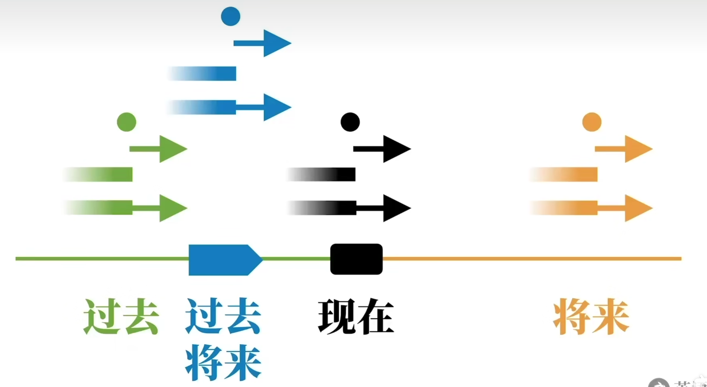

# 2 - 动词时态

$$
动词时态 = 动作的时间 + 动作的状态
$$

&emsp;&emsp;动作的时间有如下四种：现在、过去、将来、过去将来。

&emsp;&emsp;动词的状态也有四种：

1. 一般状态：表示状态没有具体说明。
2. 进行状态：动作（过程）正在进行中。
3. 完成状态：动作已经被完成了，但没有指出动作发生的时间。
4. 完成进行状态：表示动作的一部分已经完成了，但剩下的还在进行。

&emsp;&emsp;因此两两相互组合理论上有$16$种时态。16种时态能由下图表示：

## 2.1 时态的四大难点

**难点1**：时&态未分清

**难点2**：动词变位

**难点3**：助动词

**难点4**：其他语法概念混合

## 2.2 现在时间构成

### 2.2.1&emsp;现在进行时态（Present Progressive Tense）

助动词be的变位 + 动词的现在分词

1. （连）系动词

* *I am a smart rabbit.*

2. 助动词，构成时态

* *I am eating a carrot.*

### 2.2.2&emsp;现在完成时态（Present Perfect Tense）

助动词have的变位 + 动词的过去分词

&emsp;**have**

1. 实义动词

* *I have some coins for this video.*

2. 助动词，构成时态

* *I have eaten carrots.*
  

### 2.2.3&emsp;现在完成进行时态（Present Perfect Progressive Tense）

have的变位 + been + 动词的现在分词

* *I have eating carrots.*
* *You have been watching my video.*
* *I have been thinking of you.*

### 2.2.4&emsp;一般现在时（simple Present Tense）

$+$ 动词原形 / 动词原形 s (第三人称单数)

> 注：这里的一般指的是默认的，并没有特别指出的动作状态。也就是说现在的时态，反而不是正在进行的时态。

1. 表示事实

* *I eat carrots.*
* *The sun rises in the east.*
* *The earth revolves around the sun.*

2. 表达习惯 / 重复动作

* *I play basketball.*

3. 表示预计发生的事情。

* *The bus leaves at 8PM tonight.*

## 2.3 过去时间构成

### 2.3.1&emsp;过去进行时态（Past Progressive Tense）

助动词be的过去变位 + 动词的现在分词

* *The rabbit was eating a carrot.*
* *You were watching my video.*
* *I was thinking of you.*

### 2.3.2&emsp;过去完成时态（Past Perfect Tense）

助动词have的变位 + 动词的过去分词

描述：过去某一点（A）的过去（B）对过去那一点（A）的影响。

* *I had eaten 5 carrots for lunch yesterday, so I wasn't hungry at all yesterday afternoon.*

* *You have watched my video.*

### 2.3.3&emsp;过去完成进行时态（Past Perfect Progressive Tense）

助动词have的变位 + been + 动词的现在分词

描述：过去某个时刻不但完成了一部分，而且还要继续进行的动作。

* *The rabbit had been eating a carrot.*
* *You had been watching my video.*

### 2.3.4&emsp;一般过去时（simple Present Tense）

> 注：单纯的认为这个动作在过去发生了，至于是动作多久？动作何时开始？动作何时结束？都不确定。

* *The rabbit ate a carrots.*
* *You watched my video.*
* *I thought of you.*

## 2.4 将来时间构成

将来时动词本身不变形，因此需要助动词 will 来帮忙。
### 2.4.1&emsp;将来进行时态（Future Progressive Tense）

will + be + 动词的现在分词

描述：在将来的某个时间，某个动作是在进行的过程中。

* I will be eating a carrot for lunch tomorrow from 1PM to 3PM.

### 2.4.2&emsp;将来完成时态（Future Perfect Tense）

will + have + 动词的过去分词

描述：将来的某一点（A）的过去（B），对将来的一点（A）的影响。
  
* *I will have finished making the video by 4PM tomorrow, so I can publish it after that.*
* *If suddenly you forget me, Do not look for me. For I shall already have forgotten you.*
* *The rabbit will have eaten a carrot.*

### 2.4.3&emsp;将来完成进行时态（Future Perfect Progressive Tense） 

will + have + been + 动词的现在分词

描述：将来某个时刻完成了一部分动作而且还要继续进行的动作。

* *I will have been eating carrots for 2 hours by 3PM tomorrow.*
* *You will have been watching my video.*
* *I will have been thinking of you.*

### 2.4.4&emsp;一般将来时（Future Present Tense）

will + 动词原形

描述：将来某个时间点发生的动作。（说话者十分确定会发生的事）

* *I will definitely do my best to make high-quality videos.*

## 2.5 过去将来构成

过去将来的本质实际上是过去的将来，即把将来时态往前推一个时间段（推到现在的过去）而已。

### 2.5.1&emsp;将来进行时态（Future Progressive Tense）

would + be + 动词的现在分词

* *I said I would be eating a carrot at 1PM tomorrow.*

### 2.5.2&emsp;将来完成时态（Future Perfect Tense）

would + have + 动词的过去分词

* *I said I would have eaten a carrot by 1PM tomorrow.*

### 2.5.3&emsp;将来完成进行时态（Future Perfect Progressive Tense） 

would + have + been + 动词的现在分词

* *I said I would have been eating lunch for 2 hours by 1PM tomorrow.*

### 2.5.4&emsp;一般将来时（Future Present Tense）

would + 动词原形

* *I said I would eat a carrot for lunch.*
* *I knew you would watch my video.*