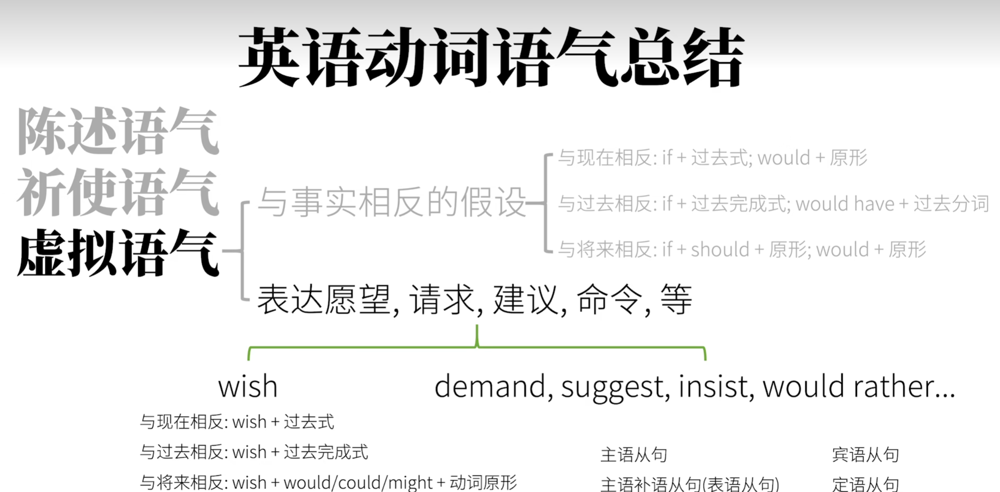

# 3 - 动词语气

动词语气主要包含：*陈述语气*、*祈使语气*、*虚拟语气*。

## 3.1 陈述语气（Indicative Mood）

陈述语气用来描述现实。

* *The rabbit ate the carrot.*

同时可以对以上这个描述现实的句子进行提问。

* *Did the rabbit eat the carrot?*

以上句子还可以归类为疑问语气。

## 3.2 祈使语气（Imperative Mood）

祈使语气用来表示命令或者请求。

* *Rabbit, eat the carrrot!*

* *Please, give me a thumbs-up!*

1. 用第二人称（你）写出一般现在时态。
2. 去掉“你”，并保证动词原形。

* *You are quiet!* $\rarr$ *Be quiet!*

## 3.3 虚拟语气（Subjunctive Mood）

### 3.3.1 表示"不可能"的假设

1. 和现在事实相反

* *If I **saw** the rabbit now, I **would** bit him*

* *if I were you, I would give this video a thumbs-up.*（虚拟语气中`be`动词都做`were`）

&emsp;**条件句**：过去式

&emsp;**主句**：would + 动词原形

2. 和将来事实相反（可能性很小）

* *If I **should see** the rabbit tomorrow, I **would** bite him.* 

&emsp;**条件句**：should（shall过去式）/were to + 动词原形

&emsp;**主句**：would / should / could / might + 动词原形

3. 和过去事实相反

* *If I **had seen** the rabbit a few days ago, I **would have** bitten him*

* *If I had watched this video before, I would have aced my test.* 

&emsp;**条件句**：had + 动词过去分词

&emsp;**主句**：would have + 动词过去分词

### 3.3.2 表达愿望、请求、建议、命令等

表示希望某个动作或者事件发生。

1. 对现在的愿望
   
* *I wish that I were a rabbit.*

&emsp;wish + 动词过去式

2. 对过去的愿望

* *I wish (that) I had eaten the carrot.*

&emsp; wish + had / would have + 动词过去分词

3. 对将来的愿望

* *I wish (that) I could eat the carrot.*

&emsp;wish + should / would / could / might + 动词原形

其中wish还能换成其他的词，例如 would rather（宁愿）。

* *I would rather that you hadn't eaten the carrot.*

demand(要求)、suggest（建议）、insist（坚持）、order（命令）等词接的虚拟语气一律是 should + 动词原形。

* *I demand that you ~~should~~ give me a carrot.*

## 3.4 总结

